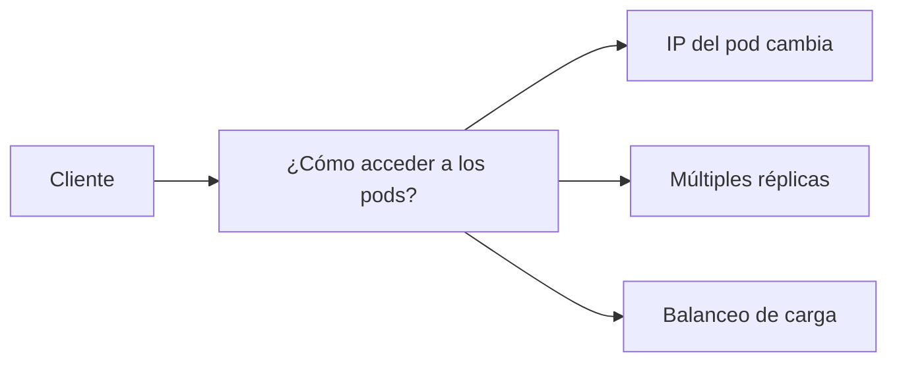
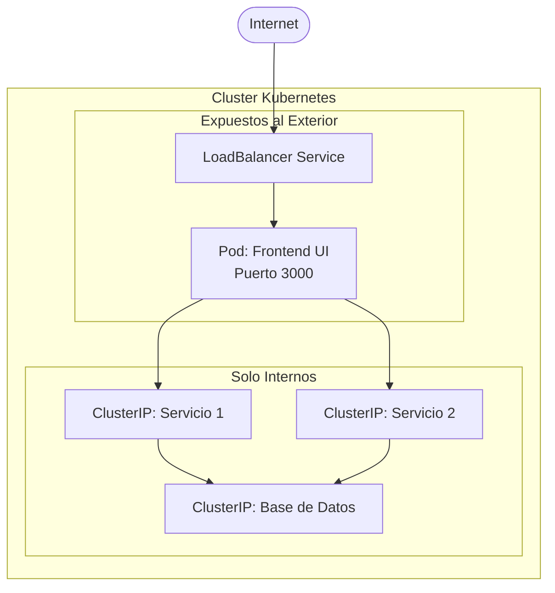
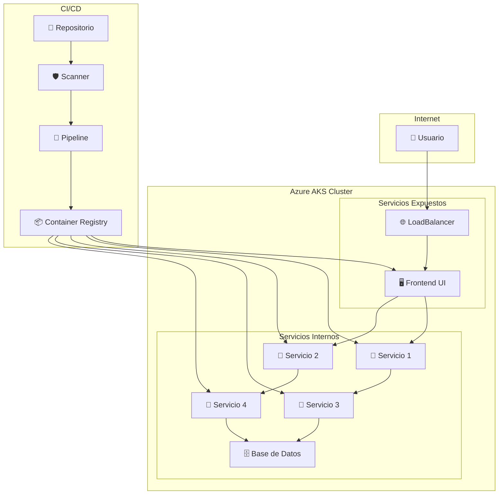

# 🚀 Kubernetes - Servicios y Cluster en Azure

> **Guía Completa de Servicios en Kubernetes y Despliegue en Azure AKS**

---

## 📋 Tabla de Contenidos

1. [Introducción](#introducción)
2. [Conceptos Previos](#conceptos-previos)
3. [¿Qué son los Servicios?](#qué-son-los-servicios)
4. [Tipos de Servicios](#tipos-de-servicios)
5. [Arquitectura Recomendada](#arquitectura-recomendada)
6. [Cluster en Azure AKS](#cluster-en-azure-aks)
7. [Comandos Esenciales](#comandos-esenciales)
8. [Proyecto Final](#proyecto-final)

---

## 🎯 Introducción

Los **Servicios en Kubernetes** son un recurso fundamental que resuelve el problema de acceso y comunicación entre pods. Hasta ahora hemos trabajado con recursos como DaemonSet, Deployment y StatefulSet, pero necesitamos una forma de hacer que nuestras aplicaciones sean accesibles tanto internamente como externamente.

---

## 📚 Conceptos Previos

### Recursos de Kubernetes que ya conocemos:

| Recurso         | Descripción                              | Uso                            |
| --------------- | ---------------------------------------- | ------------------------------ |
| **DaemonSet**   | Despliega un pod en cada nodo            | Monitoreo, logs, agentes       |
| **Deployment**  | Despliega pods con réplicas distribuidas | Aplicaciones stateless         |
| **StatefulSet** | Para aplicaciones con estado persistente | Bases de datos, almacenamiento |

### El Problema que Resuelven los Servicios



---

## 🔧 ¿Qué son los Servicios?

Los servicios en Kubernetes son **la puerta de entrada a los pods** y resuelven problemas críticos:

### 🎯 Problemas que Resuelven

#### 1. **Acceso Consistente**

- Los pods pueden cambiar de IP cuando se reinician
- Los servicios proporcionan una IP estable
- Actúan como proxy hacia los pods

#### 2. **Balanceo de Carga Automático**

**💡 Escenario Ejemplo: Black Friday**

```
┌─────────────────────────────────────┐
│           Node 01                   │
│  ┌─────────┐ ┌─────────┐ ┌─────────┐│
│  │ Pod 1   │ │ Pod 2   │ │ Pod 3   ││
│  │titostore│ │titostore│ │titostore││
│  └─────────┘ └─────────┘ └─────────┘│
└─────────────────────────────────────┘
            ↑
    ┌───────────────┐
    │   Service     │ ← Distribuye peticiones
    │ (Load Balance)│
    └───────────────┘
            ↑
    🛒 Miles de peticiones
```

**Sin Balanceo**: Un pod se satura ❌  
**Con Servicio**: Carga distribuida entre los 3 pods ✅

---

## 🏗️ Tipos de Servicios

### 1. 🔒 ClusterIP (Por Defecto)

**Uso**: Comunicación interna entre servicios

```yaml
apiVersion: v1
kind: Service
metadata:
  name: hello
spec:
  type: ClusterIP # Opcional (es el default)
  ports:
    - port: 8080
      targetPort: 8080
  selector:
    role: hello # Selecciona pods con label "role: hello"
```

**Características:**

- ✅ Solo accesible dentro del cluster
- ✅ IP interna y estable
- ✅ Perfecto para microservicios
- ❌ No accesible desde fuera

**Comandos de Prueba:**

```bash
kubectl apply -f clusterip-service.yaml
kubectl get svc
kubectl describe svc hello
kubectl exec -it ubuntu -- sh  # Probar desde dentro del cluster
```

---

### 2. 🌐 NodePort

**Uso**: Exposición básica hacia el exterior

```yaml
apiVersion: v1
kind: Service
metadata:
  name: hello-nodeport
spec:
  type: NodePort
  ports:
    - port: 8080
      targetPort: 8080
      nodePort: 30000 # Puerto en rango 30000-32767
  selector:
    role: hello
```

**Características:**

- ✅ Accesible desde fuera del cluster
- ✅ IP del nodo + puerto específico
- ⚠️ Requiere conocer IP de los nodos
- ⚠️ Puertos limitados (30000-32767)

**Acceso**: `http://<IP_NODO>:30000`

**Para Minikube:**

```bash
minikube service hello-nodeport --url
```

---

### 3. ⚖️ LoadBalancer

**Uso**: Exposición profesional en la nube

```yaml
apiVersion: v1
kind: Service
metadata:
  name: hello-loadbalancer
spec:
  type: LoadBalancer
  ports:
    - port: 8080
      targetPort: 8080
  selector:
    role: hello
```

**Características:**

- ✅ IP pública automática
- ✅ No requiere puertos específicos
- ✅ Balanceo nativo del proveedor cloud
- ✅ Ideal para producción

**Para Minikube:**

```bash
minikube tunnel  # Simula LoadBalancer localmente
kubectl get svc hello-loadbalancer  # Ver EXTERNAL-IP
```

---

## 🏛️ Arquitectura Recomendada

### Patrón de Exposición de Servicios



### 📋 Reglas de Exposición

| Tipo de Servicio  | Cuándo Exponer     | Tipo de Service       |
| ----------------- | ------------------ | --------------------- |
| **Frontend/UI**   | ✅ Siempre         | LoadBalancer/NodePort |
| **APIs Públicas** | ✅ Si es necesario | LoadBalancer/NodePort |
| **Swagger/Docs**  | ⚠️ Opcional        | NodePort              |
| **APIs Internas** | ❌ Nunca           | ClusterIP             |
| **Base de Datos** | ❌ Nunca           | ClusterIP             |
| **Cache/Redis**   | ❌ Nunca           | ClusterIP             |

---

## ☁️ Cluster en Azure AKS

### 🛠️ Configuración del Cluster

#### Paso 1: Configuración Básica

```
Resource Group: [usar existente]
Cluster preset: Dev/Test
Cluster name: UAGRM-CLUSTER
Region: (US) West US 2
Fleet Manager: None
AKS pricing tier: Standard
Kubernetes version: 1.32.9
```

#### Paso 2: Node Pools

- ✅ **Enable node auto-provisioning**
- **Beneficio**: Crea/elimina nodos automáticamente según demanda
- **Ahorro**: Solo pagas por recursos que usas

#### Paso 3: Configuraciones Adicionales

- **Networking**: Configuración de red por defecto
- **Monitoring**: Incluye Prometheus para monitoreo
- **Security**: Configuraciones de seguridad estándar
- **Advanced**: Configuraciones avanzadas opcionales

---

### 🔗 Conexión al Cluster

#### Requisitos Previos

```bash
# Instalar Azure CLI
curl -sL https://aka.ms/InstallAzureCLIDeb | sudo bash

# Instalar kubectl
curl -LO "https://dl.k8s.io/release/$(curl -L -s https://dl.k8s.io/release/stable.txt)/bin/linux/amd64/kubectl"
sudo install -o root -g root -m 0755 kubectl /usr/local/bin/kubectl
```

#### Comandos de Conexión

```bash
# 1. Login a Azure
az login

# 2. Conectar al cluster AKS
az aks get-credentials --resource-group <RESOURCE_GROUP> --name UAGRM-CLUSTER

# 3. Verificar conexión
kubectl get nodes

# 4. Ver información del cluster
kubectl cluster-info
```

#### Desplegar Aplicación

```bash
# Aplicar manifiestos
kubectl apply -f deployment.yml
kubectl apply -f service.yml

# Verificar despliegue
kubectl get all
kubectl get svc
```

---

### 🖥️ Verificación en Azure Portal

#### Navegación en el Portal

1. **Kubernetes resources**

   - **Namespaces**: Ver espacios de nombres
   - **Workloads**: Deployments, pods, etc.
   - **Services and ingresses**: Servicios expuestos

2. **Monitoring**

   - Métricas de nodos
   - Uso de recursos
   - Logs de aplicación

3. **Overview → Connect**
   - Instrucciones de conexión
   - Comandos Azure CLI

---

## 💻 Comandos Esenciales

### Comandos Básicos de Servicios

```bash
# Ver todos los recursos
kubectl get all

# Ver servicios específicamente
kubectl get svc
kubectl get svc -o wide

# Describir un servicio
kubectl describe svc <nombre-servicio>

# Ver pods con sus IPs
kubectl get pods -o wide

# Aplicar configuraciones
kubectl apply -f service.yaml

# Eliminar servicio
kubectl delete svc <nombre-servicio>
```

### Comandos de Debug y Troubleshooting

```bash
# Ver logs de un pod
kubectl logs <pod-name>
kubectl logs -f <pod-name>  # Seguir logs en tiempo real

# Ejecutar comandos dentro de un pod
kubectl exec -it <pod-name> -- bash
kubectl exec -it <pod-name> -- sh

# Hacer port-forward para pruebas
kubectl port-forward svc/<service-name> 8080:8080

# Ver eventos del cluster
kubectl get events --sort-by='.metadata.creationTimestamp'
```

### Comandos para Minikube

```bash
# Obtener URL del servicio
minikube service <nombre-servicio> --url

# Habilitar LoadBalancer (tunnel)
minikube tunnel

# Ver dashboard
minikube dashboard

# Estado del cluster
minikube status
```

---

## 🎓 Proyecto Final

### ✅ Requisitos Obligatorios

#### 1. **🏗️ Cluster en Azure AKS**

- Cluster configurado con auto-provisioning
- Mínimo 3 nodos (puede auto-escalar)
- Monitoreo habilitado (Prometheus)

#### 2. **🚀 Aplicación Desplegada**

- **5 servicios interconectados**
- Cada servicio con su Service de Kubernetes correspondiente
- Frontend/UI expuesto con LoadBalancer
- Servicios internos usando ClusterIP

#### 3. **🔄 CI/CD Pipeline**

- Repositorios de código fuente
- Pipelines automatizados
- Container Registry (Docker Hub, Azure ACR)
- Deploy automático al cluster

#### 4. **🔒 Seguridad**

- **Scanners de seguridad** implementados:
  - Análisis de código fuente
  - Escaneo de imágenes de contenedores
  - Validación antes del build

#### 5. **📁 Configuraciones de Kubernetes**

- Manifiestos organizados (YAML)
- ConfigMaps y Secrets
- Documentación completa

### 📊 Arquitectura Esperada del Proyecto



### 📅 Fecha de Defensa

**🗓️ Martes próximo**

**Formato de Defensa:**

- Todos los participantes del equipo deben participar
- Cada miembro debe explicar la parte en la que trabajó
- Demostración en vivo del sistema funcionando
- Explicación de la arquitectura y decisiones técnicas

---

## 🔗 Enlaces de Referencia

### Documentación Official

- [Kubernetes Services](https://kubernetes.io/docs/concepts/services-networking/service/)
- [Azure AKS](https://docs.microsoft.com/en-us/azure/aks/)
- [kubectl Reference](https://kubernetes.io/docs/reference/kubectl/)

### Herramientas Útiles

- [Minikube](https://minikube.sigs.k8s.io/docs/start/)
- [Azure CLI](https://docs.microsoft.com/en-us/cli/azure/install-azure-cli)
- [Visual Studio Code Kubernetes Extension](https://marketplace.visualstudio.com/items?itemName=ms-kubernetes-tools.vscode-kubernetes-tools)

---

## 📝 Notas Adicionales

### Tipos de Enrutamiento Avanzado

#### Ingress Controllers

- **Uso**: Enrutamiento HTTP/HTTPS avanzado
- **Beneficios**: Un solo punto de entrada, SSL termination
- **Casos**: Múltiples servicios con diferentes rutas
- **⚠️ Nota**: No se incluye en el proyecto final

```yaml
# Ejemplo de Ingress (solo referencia)
apiVersion: networking.k8s.io/v1
kind: Ingress
metadata:
  name: example-ingress
spec:
  rules:
    - host: api.miapp.com
      http:
        paths:
          - path: /v1
            pathType: Prefix
            backend:
              service:
                name: api-v1
                port:
                  number: 80
```

### Mejores Prácticas

#### Naming Conventions

```bash
# Servicios
<app-name>-<component>-svc

# Ejemplos
titostore-frontend-svc
titostore-api-svc
titostore-database-svc
```

#### Labels y Selectors

```yaml
# Consistencia en labels
metadata:
  labels:
    app: titostore
    component: frontend
    version: v1.0.0

# Selector correspondiente
selector:
  app: titostore
  component: frontend
```

---

**📚 Documento creado basado en las notas de clase de Kubernetes - Servicios y Azure AKS**

_Última actualización: Diciembre 2025_
